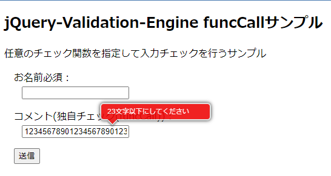

# jQuery-Validation-Engine で任意のチェック関数を利用する

## はじめに

jQuery-Validation-Engineは、class名の指定だけで入力チェックができる便利なライブラリです。

事前に用意されているチェックでは足りない、動的なチェック、動的なエラーメッセージを使いたい場合は`funcCall`を使うことで、任意の処理を呼び出してチェックさせることができます。

(本家[posabsolute/jQuery-Validation-Engine](https://github.com/posabsolute/jQuery-Validation-Engine#funccallmethodname)には記載があるのですが、ググっても見つからないので備忘録として残します)


### 使い方

 ([参考ページ](https://www.omakase.net/blog/2020/10/validationengine.html)を見てもらった方が早いです)

#### ①[[jQuery-Validation-Engine](https://github.com/posabsolute/jQuery-Validation-Engine#funccallmethodname)]を読み込みます

```html
  <link rel="stylesheet" href="https://cdnjs.cloudflare.com/ajax/libs/jQuery-Validation-Engine/2.6.4/validationEngine.jquery.min.css">
  <script src="https://cdnjs.cloudflare.com/ajax/libs/jquery/3.6.0/jquery.min.js"></script>
  <script src="https://cdn.jsdelivr.net/gh/posabsolute/jQuery-Validation-Engine@3.1.0/js/jquery.validationEngine.min.js"></script>
  <script src="https://cdn.jsdelivr.net/gh/posabsolute/jQuery-Validation-Engine@3.1.0/js/languages/jquery.validationEngine-ja.js"></script>
```
  * `jquery.validationEngine-ja.js`は、チェックを追加する場合が多いので、cdnから読み込まない方が良いです（が、今回は変更しないのでcdnから読み込み)


#### ②入力フォームを作成します

* 独自チェック(checkComment()関数でチェック)を呼び出すため`class="validate[funcCall[checkComment]]"`を追加

```html
  <form id="input_form">
    <div class="input-area">
      <label for="comment-name">お名前必須：</label><br>
      <input type="text" name="comment-name" id="comment-name" class="validate[required]">
    </div>
    <div class="input-area">
      <label for="comment-input">コメント(独自チェック(funcCall))：</label><br>
      <input type="text" name="comment-input" id="comment-input" class="validate[funcCall[checkComment]]" value="">
    </div>
    <div class="input-area">
      <button>送信</button>
    </div>
  </form>
```

#### ③独自チェック関数を作成

* グローバル関数で作成します
  * チェックを行い、エラーメッセージを返す関数を作成する

```javascript
    // 入力チェック関数
    function checkComment(field, rules, i, options){
      const h = (new Date()).getHours();
      if (field.val().length > h) {
        return `${h}文字以下にしてください`;
      }
    }
```
#### ④jQuery-Validation-Engineを初期化
```javascript
    // jQuery-Validation-Engine初期化
    $(function () {
      $("#input_form").validationEngine('attach');
    });
```

### 動作確認

* 時間に応じて、入力チェック内容とメッセージが変わる処理ができました


## 参考ページ
* [jQuery：リアルタイムなフォーム入力チェックを簡単に実装！「validationEngine」の使い方](https://www.omakase.net/blog/2020/10/validationengine.html)
